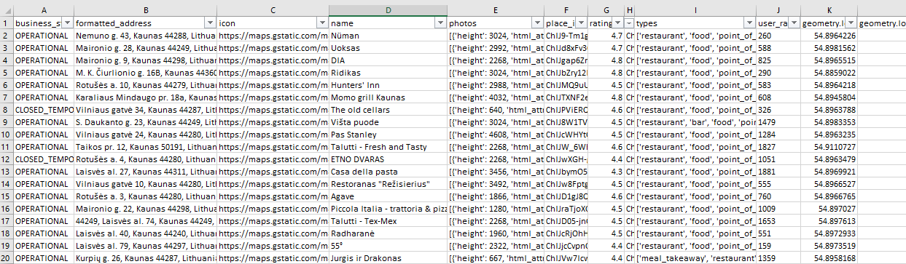
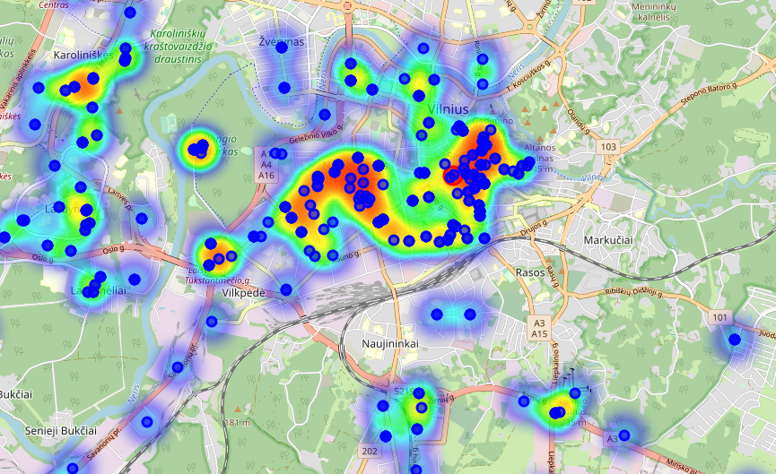

# About

Using Google API key script collects all data from the call and stores combined data to CSV file.

If file does not exist file is saved with headers and if file already exist it will extend the file. Using multiple calls can required information.

# How to get API Key

More information how to get the key in link below.

https://developers.google.com/maps/documentation/javascript/get-api-key

API key is free to use up to 100 Eur limit per month.

2000 calls ended in a 63 Eur sum :))

# Example

# Conert collected data to interactive map

Once requried data is collected with *gapi_results_to_map* this can be converted to interactive map.

Please change starting location coordinates based on your preference or data location.

